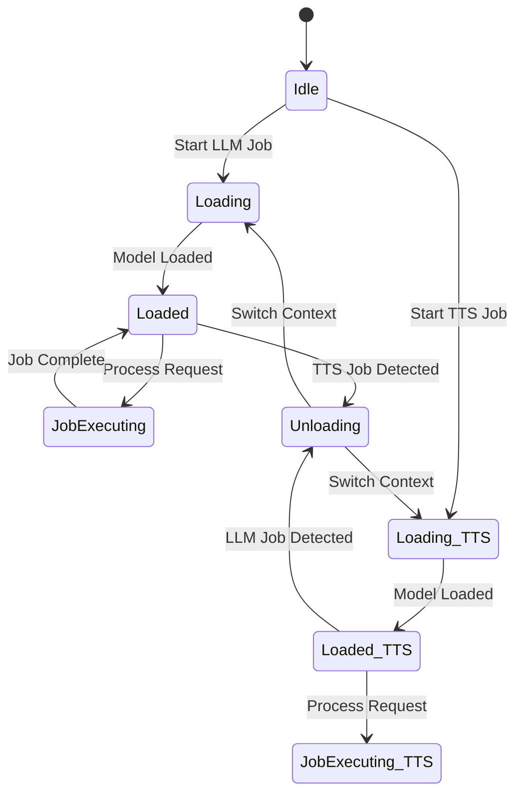

# YSS (Your Shorts Studio) - Technical Architecture

## 1. System Overview

A desktop video creation tool for 30-60 second vertical shorts with 100% local AI processing via Ollama, zero external APIs, and full offline operation after initial setup.

## 2. Architecture Diagram

```
┌─────────────────────────────────────────────────────────────┐
│                    ELECTRON FRONTEND                        │
│              (React + TypeScript + Vite)                   │
│  ┌─────────────┐ ┌─────────────┐ ┌─────────────────────┐   │
│  │   Project   │ │  Timeline   │ │   Script/Settings   │   │
│  │   Manager   │ │   Editor    │ │     Workspace       │   │
│  └─────────────┘ └─────────────┘ └─────────────────────┘   │
└───────────────────────────┬─────────────────────────────────┘
                            │ HTTP API (FastAPI)
                            ▼
┌─────────────────────────────────────────────────────────────┐
│                    PYTHON BACKEND                           │
│              (FastAPI + asyncio + multiprocessing)         │
│  ┌───────────────────────────────────────────────────────┐  │
│  │              Service Manager                           │  │
│  │  - Ollama process management                          │  │
│  │  - FFmpeg process management                          │  │
│  │  - Resource queue system                              │  │
│  │  - VRAM monitoring & management                       │  │
│  └───────────────────────────────────────────────────────┘  │
│  ┌─────────────┐ ┌─────────────┐ ┌─────────────────────┐   │
│  │  LLM API    │ │ Audio Engine│ │   Video Engine    │   │
│  │  (Ollama)   │ │  (TTS/STT)  │ │   (FFmpeg)        │   │
│  └─────────────┘ └─────────────┘ └─────────────────────┘   │
└─────────────────────────────────────────────────────────────┘
                            │
                            ▼
┌─────────────────────────────────────────────────────────────┐
│                    LOCAL AI STACK                           │
│  ┌─────────────┐ ┌─────────────┐ ┌─────────────────────┐   │
│  │  Ollama     │ │ Whisper     │ │   FFmpeg          │   │
│  │  (Llama 3.1)│ │  (STT)      │ │   (Encoding)      │   │
│  └─────────────┘ └─────────────┘ └─────────────────────┘   │
└─────────────────────────────────────────────────────────────┘
```

## 3. VRAM Budget Allocation

### Target Hardware: RTX 3060 12GB
- **Hard ceiling**: 12GB VRAM
- **Active usage target**: 10GB (2GB headroom)

### Allocation Strategy

| Component | Max VRAM | Fallback | Notes |
|-----------|----------|----------|-------|
| LLM (Llama 3.1 8B Q4_K_M) | 6-8GB | 4GB (Q3_K_M) | Unload between operations |
| Orpheus TTS | 3GB | CPU | Unload LLM when active |
| OpenVoice Clone | 4GB | CPU | One-time per voice |
| Whisper (small) | 2GB | CPU | Dynamic loading |
| Video Engine | 1GB | CPU | FFmpeg NVENC fallback |
| System Overhead | 1GB | - | CUDA context, buffers |

### Resource Management

- **GPU Operations Queue**: Single queue for all GPU operations
- **Priority system**: Video encoding > Audio generation > LLM inference
- **OOM handling**: Graceful degradation with automatic model switching
- **Context window management**: Dynamic adjustment based on available VRAM

## 4. Project File Format (.yss)

### Container Structure
```
project_name.yss (ZIP container)
├── manifest.yaml          # Project metadata
├── assets/                # All media assets
│   ├── video/
│   ├── audio/
│   └── images/
├── voices/                # Custom voice clones
│   └── {voice_name}/
│       ├── reference.wav
│       └── config.json
├── render_cache/          # Intermediate render files
└── scripts/               # Script versions
```

### manifest.yaml Schema
```yaml
version: "1.0"
project_name: "My First Short"
created_at: "2024-01-15T10:30:00Z"
updated_at: "2024-01-15T11:45:00Z"
duration: 45  # seconds
resolution: "1080x1920"
fps: 30
platform: "youtube_shorts"

metadata:
  title: ""
  description: ""
  hashtags: []

timeline:
  video_tracks: []
  audio_tracks:
    - id: "voiceover"
      type: "voiceover"
      volume: 0.8
      ducking:
        enabled: true
        threshold: -30
        attack: 100
        release: 250
    
    - id: "background_music"
      type: "music"
      volume: 0.3

assets:
  video_clips: []
  audio_clips:
    - id: "voiceover_main"
      source: "assets/audio/voiceover.wav"
      start: 0
      duration: 45
      track: "voiceover"
    
    - id: "music_intro"
      source: "assets/audio/music.mp3"
      start: 0
      duration: 45
      track: "background_music"

scenes:
  - id: "scene_1"
    start: 0
    duration: 15
    script_text: "First scene content"
    visual_description: "Person speaking directly to camera"
    captions: true

settings:
  ai:
    model: "llama3.1:8b-q4_k_m"
    context_size: 4096
    max_output: 1024
    vram_safeguard: true
  captions:
    model: "small"
    language: "auto"
    burn_in: true
```

## 5. Data Flow: Model Loading/Unloading



### State Management Logic

```python
class ResourceManager:
    def __init__(self):
        self.current_state = "idle"
        self.vram_usage = 0
        self.model_cache = {}
    
    def schedule_operation(self, operation_type):
        if self.needs_model_load(operation_type):
            if self.vram_exceeded():
                self.unload_highest_vram_model()
            self.load_model(operation_type)
        
        if self.vram_exceeded():
            raise VRAMExceededError("Switching to CPU fallback")
    
    def load_model(self, model_type):
        # Implementation details
        pass
    
    def unload_model(self, model_type):
        # Implementation details
        pass
```

## 6. Service Communication Protocol

### Ollama API (localhost:11434)
- Native HTTP API for LLM operations
- Stream support for real-time generation
- Model loading/unloading via `/api/generate` with `stream: false`

### Backend API (localhost:8000)
- FastAPI REST endpoints
- EventStream for progress updates
- WebSocket for real-time timeline synchronization

### Frontend Integration
- HTTP client for API calls
- IPC for process management (Electron)
- Local file system access for project operations

## 7. Error Handling Strategy

### VRAM Exhaustion
1. Detect OOM error from GPU
2. Unload non-essential models
3. Fall back to smaller model quantization
4. Reduce context window
5. Switch to CPU processing if GPU fails

### Missing Dependencies
1. Check for Ollama installation
2. Verify CUDA drivers
3. Validate FFmpeg installation
4. Provide helpful error messages with installation links

### Network Failures (After Initial Setup)
- All operations should function offline
- Internet-dependent features: model downloads, updates
- Graceful degradation for network-dependent features

## 8. Cross-Platform Compatibility

### Windows 11
- Use bundled NVIDIA drivers
- CUDA runtime bundled with installation
- FFmpeg from official releases

### Pop!_OS 22.04 LTS
- System NVIDIA drivers (535+)
- System CUDA toolkit
- FFmpeg from repositories

### File Paths
- Windows: `C:\Users\{user}\AppData\Roaming\yss\`
- Linux: `~/.config/yss/`
- Project files: Self-contained, portable

## 9. Performance Targets

| Operation | Target Time | Max VRAM | Notes |
|-----------|-------------|----------|-------|
| LLM inference (20 tok/s) | 20s for 400 tokens | 6-8GB | Q4_K_M quantization |
| Orpheus TTS (30s audio) | <10s | 3GB | Unload LLM first |
| OpenVoice clone (30s) | <30s | 4GB | One-time setup |
| Whisper transcription | 0.5× realtime | 2GB | small model |
| Video export (60s 1080p) | <3 min | 1GB | NVENC enabled |

## 10. Build & Deployment Strategy

### Production Build
- Electron: Cross-platform desktop app
- Python backend: PyInstaller bundled executable
- Frontend: React with Vite for optimized builds

### Installation Process
1. Check system requirements
2. Install NVIDIA drivers if needed
3. Install CUDA runtime
4. Install Ollama
5. Download required models
6. Extract application files

### First-Time Setup
- Download and load default Llama 3.1 model
- Verify GPU functionality
- Create default project directory structure
- Test AI pipeline end-to-end

## 11. Security Considerations

- No telemetry or data collection
- All processing local to user machine
- No external network calls after initial setup
- Project files encrypted with user password (optional)
- Secure storage for custom voice references

## 12. Future Roadmap

### Phase 2 Enhancements
- Advanced AI scene suggestions
- Local B-roll search (image database)
- Multi-language support
- Batch processing

### Performance Optimizations
- Quantization strategies for smaller models
- Progressive loading for large models
- GPU memory pooling
- Multi-GPU support

---

**Version**: 1.0  
**Last Updated**: 2024-01-15  
**Status**: Technical Design Complete